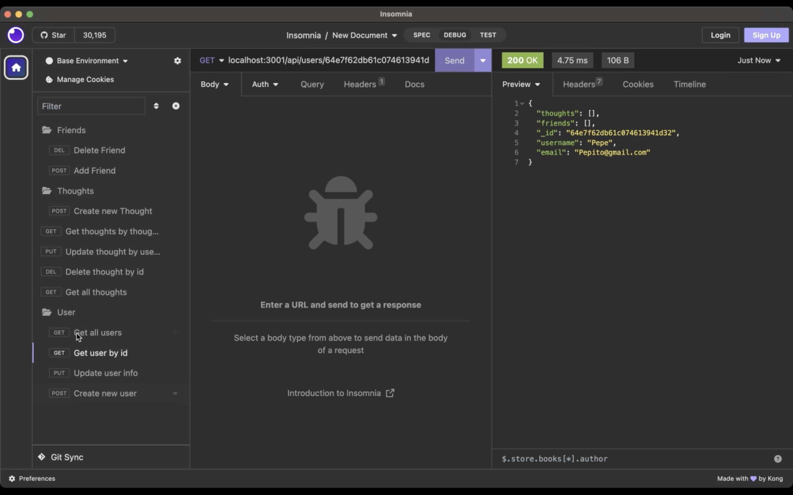
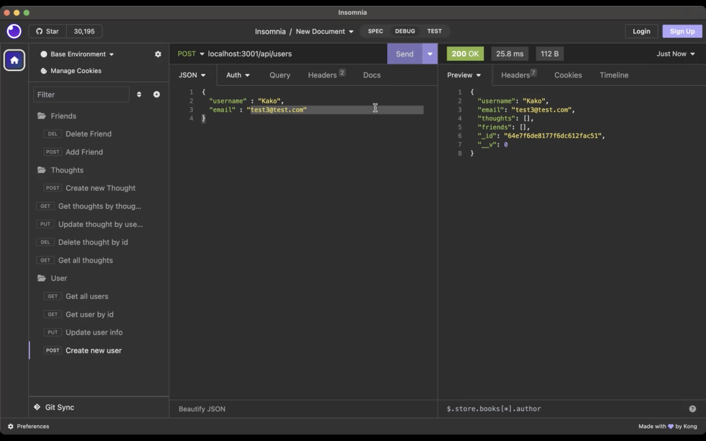
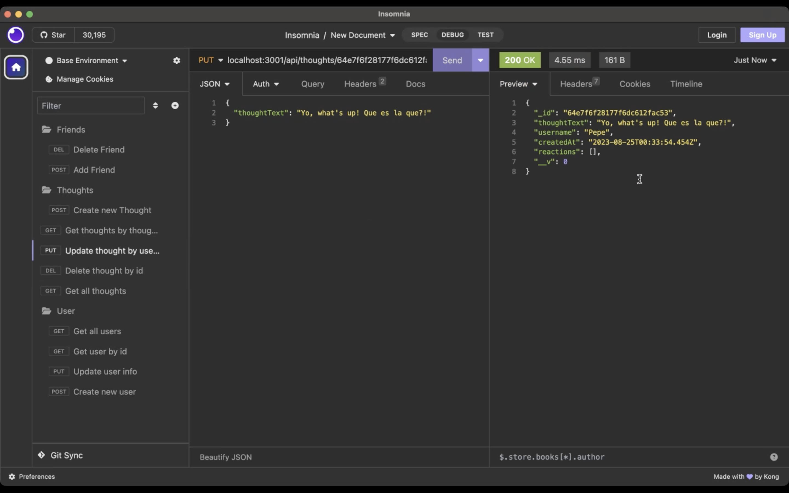
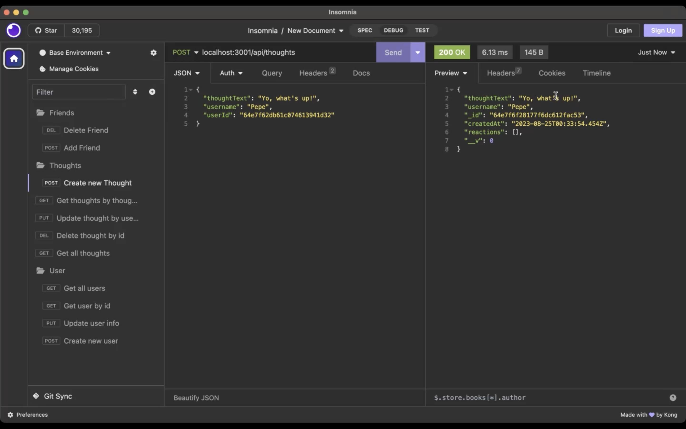
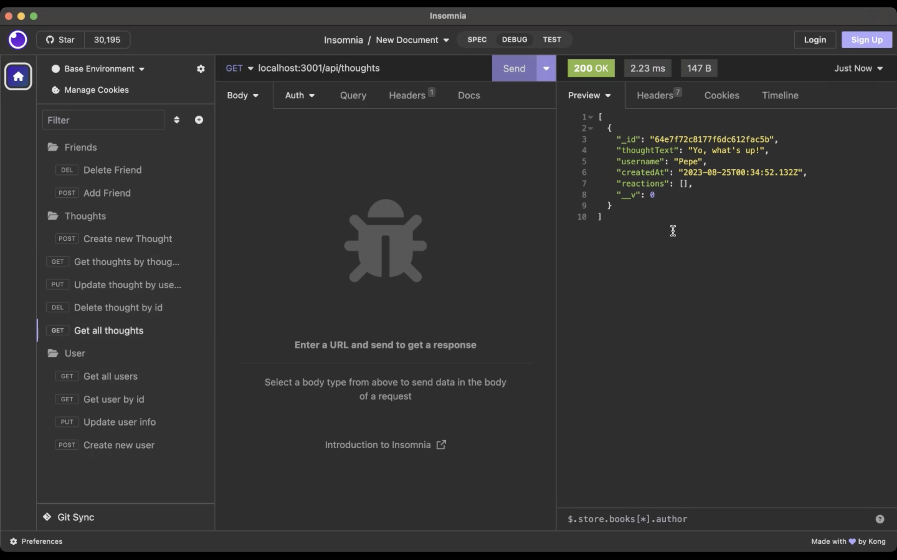
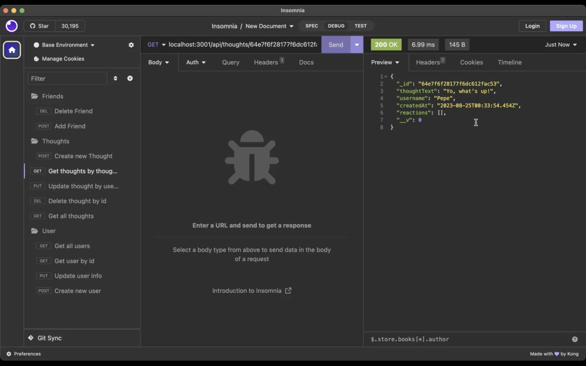
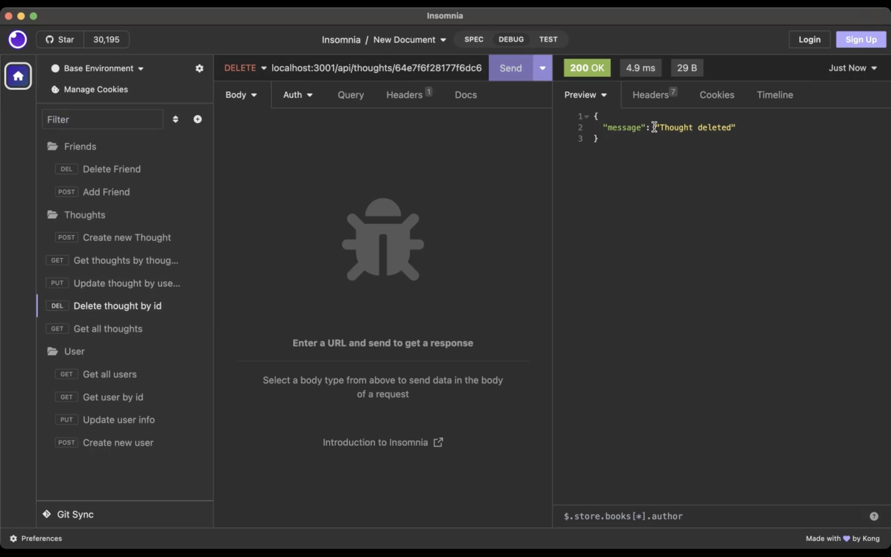
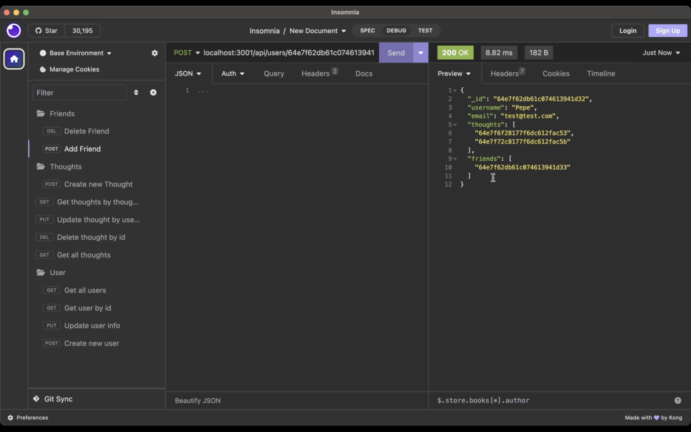
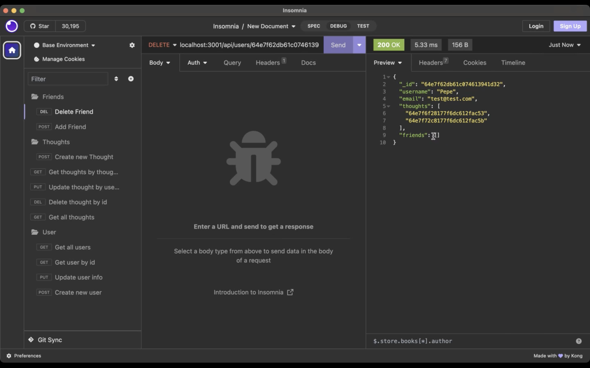
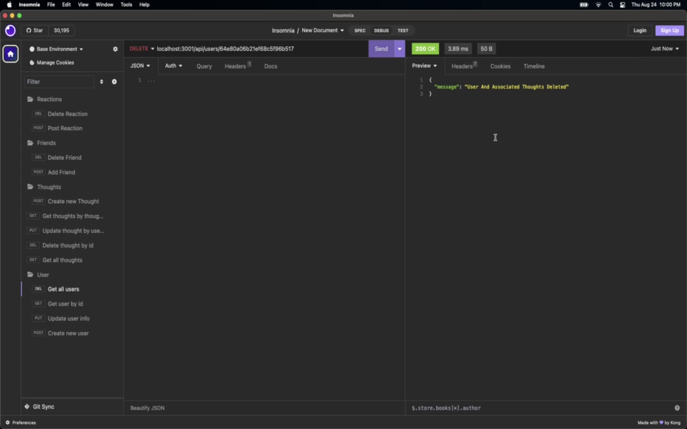

# socialNetwork_NoSQL

## Table of Contents
- [Description](#description)
- [Installation](#installation)
- [Usage](#usage)
- [Contributing](#contributing)
- [Tests](#tests)
- [Questions](#questions)
- [License](#license)

## Description

socialNetwork_NoSQL is a vibrant social platform connecting friends. Users can be Created, Updated, Deleted and Observed. By using developer tools we will be able to see all the perks about using MongoDB and NoSQL parameters to ease the functionality of collections.

## Installation

First, search for repository on Github called socialNetwork_NoSQL. Then, on the top-right corner, click 'Code' and copy the link. Afterwards, go to VSCode and open the local terminal from the desired parent repostory where you desire to install the socialNetwork_NoSQL. Then, write 'git clone (paste link here)'. Finally, you'll notice the repository has been installed for your convenience. Make sure to write your credentials on the .env file, and download the proper dependencies (npm i). After all the dependencies have been downloaded, then we run the seeds (npm run seeds). Before making any changes, make sure that the propper dependencies have been downloaded to prevent bugs or functionality issues.

## Usage

First, right-click on the parent repository called socialNetwork_NoSQL and select "Open integrated terminal". As a rule, run the server by writing index.js on the terminal and wait for it to run. When it has been successfull, Verify with Compass MongoDB to see if the collections was seeded. Finally, go to Insomnia and make all the api hits necessary to get all the data. You will be able to See all users, Create new users, Search users by id and update user information. Also, You'll be able to create new thoughts, search for thoughts by id, update thought by Id, update and delete Thought by ID. Finally, you will be able to add friend and delete friend according to their ID's on either the seeded data or new users created.

## Contributing

If you would like to contribute as a developer, you can submit a pull request. Before starting any substantial work, it's recommended to open an issue to discuss your proposed changes with the lead developer.

# Screenshots

## Next screenshots will create understanding of the website's functionality.
# a. GET all Users 
# b. GET User by ID 
# c. Create New User 
# d. Update User 
# e. Post Thoughts 
# f. Update Thought
# g. Get All Thoughts 
# h. Get Thought by ID 
# i. Delete Thought By ID 
# j. Add Friend 
# k. Delete Friend 
# l. Delete User with Associated Thoughts 
 
 
## Refferences

1. <a href = https://www.w3schools.com/>W3Schools</a>

2. <a href = https://stackoverflow.com/>Community Forums & Stack Overflow</a>

3. <a href =https://mongoosejs.com/docs/tutorials/virtuals.html>Mongoose Virtuals</a>

4. <a href =https://www.youtube.com/watch?v=CMaXuKK3Jjc>NoSQL Challenge Social Network API Module 18</a>

5. <a href =https://developer.mozilla.org/en-US/docs/Glossary/MVC>MDN Web Docs</a>

6. <a href =https://www.youtube.com/watch?v=RmH8fCtmXp4>Module 18 Challenge: NoSQL - Social Network API</a>

## Video Link
https://drive.google.com/file/d/13fZIGHgKkPqN5kYHyPcjC-WEpy5tNOpi/view

## Github Repository
https://github.com/QuitoMusic/socialNetwork_NoSQL

## Questions

For any questions, please contact us:

- GitHub: [QuitoMusic](https://github.com/QuitoMusic)

## License

This project is licensed under the MIT License.